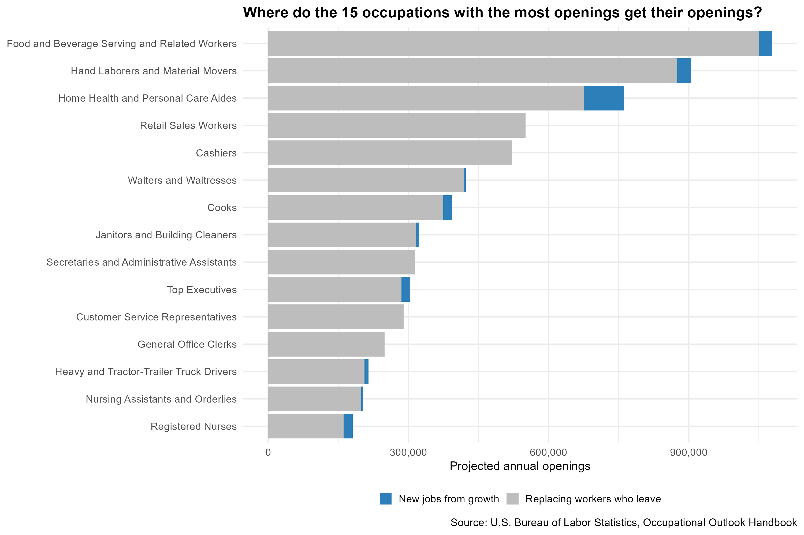

## The question

"Fastest-growing occupation" sounds like a good bet for a career or a major. But growth rate is a *relative* number -- it tells you how fast an occupation is expanding, not how many people it will actually hire. What determines whether you can get a job is the number of **annual openings**, and a large share of those openings has nothing to do with growth at all: they come from replacing workers who retire, switch fields, or leave the workforce.

So across every occupation the U.S. Bureau of Labor Statistics tracks, how well does growth rate line up with annual openings? And if they disagree, which one should someone actually use when picking a field to train for?

## Data and method

I scraped all 343 occupation profile pages from the BLS [Occupational Outlook Handbook](https://www.bls.gov/ooh/) using `rvest`. The list of occupations came from the OOH's own A-Z index, so nothing was hand-picked. For each occupation I pulled the median annual pay, current employment, the 2025-35 projected growth rate, the projected employment change, and the projected number of annual openings.

This is public government data with no login or paywall involved. Before scraping, I checked `robots.txt` and the BLS website policies. Two occupations (fishing workers and military careers) don't publish a standard salary figure and were dropped; 341 occupations remain in the analysis.

**The full scraping, cleaning, and analysis code is available here:**

<a href="https://github.com/xushiori-svg/Web-Scraping-" 
   target="_blank" 
   style="display:inline-block; padding:10px 18px; background-color:#24292f; 
          color:#ffffff; text-decoration:none; border-radius:6px; 
          font-family:sans-serif; font-size:14px;"> 📂 View code on GitHub </a>

## Growth and openings barely move together

```{r}
#| echo: false
#| message: false
library(readr)
cor_tbl <- read_csv("results/tables/growth_vs_openings_correlation.csv", show_col_types = FALSE)
```

Across the 341 occupations, the correlation between projected growth rate and projected annual openings is close to zero (Pearson `r round(cor_tbl$value[cor_tbl$metric=="pearson_cor"], 2)`, Spearman rank `r round(cor_tbl$value[cor_tbl$metric=="spearman_cor"], 2)`). Of the 20 fastest-growing occupations, only `r cor_tbl$value[cor_tbl$metric=="top20_overlap"]` also appears among the 20 occupations with the most annual openings.


The occupations with the highest growth rates -- Solar Photovoltaic Installers (37%), Nurse Practitioners and similar roles (36%), Data Scientists (35%) -- have annual openings in the thousands, not the hundreds of thousands. Meanwhile occupations like Food and Beverage Serving Workers or Retail Sales Workers, whose growth rates are unremarkable or even negative, post six-figure annual openings because they are simply enormous occupations to begin with. Growth rate describes the *shape* of an occupation's trajectory; it says almost nothing about its *scale*.

## Most openings aren't from growth at all

```{r}
#| echo: false
#| message: false
```



Breaking down the 15 occupations with the most annual openings into "new jobs from growth" versus "replacing workers who leave" makes the point directly. For most of these occupations -- Retail Sales Workers, Cashiers, Secretaries and Administrative Assistants, General Office Clerks -- the blue "new jobs from growth" segment is barely visible. Nearly every opening in these fields exists because someone is leaving, not because the occupation is expanding.

## Takeaway

Don't pick a field just because its growth rate is high. Check the annual openings number too — that's how many people actually get hired each year. A fast-growing field can still be small and hard to break into. A slow-growing field can still hire a lot of people every year, just because it's big.

The table below lists, for each typical entry-level education level, the occupations that pay above the U.S. median wage (\$50,980) and have the highest opening rate (openings as a share of current employment).

```{r}
#| echo: false
#| message: false
library(knitr)
read_csv("results/tables/top_openings_by_education.csv", show_col_types = FALSE) |>
  kable(digits = 1, col.names = c("Education", "Occupation", "Median pay ($)",
                                   "Growth (%)", "Annual openings", "Opening rate (%)"))
```

## Limitations

These numbers are national averages. Actual demand can be very different by state or city. 36 occupations don't have one clear education level (they're broad groups, like "Water Transportation Occupations"). I left them out of the education table, but they're still in the correlation numbers above.
