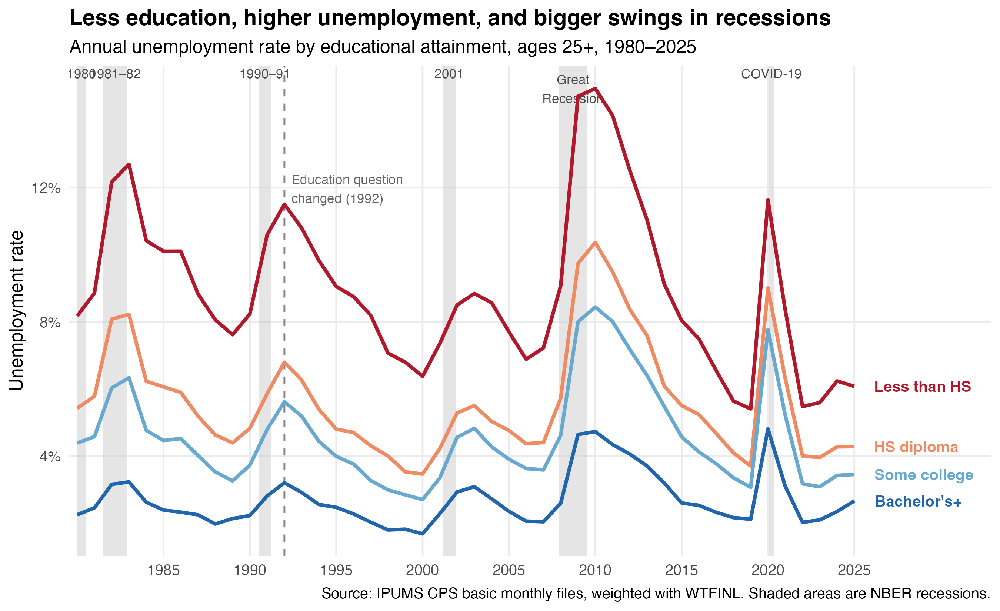
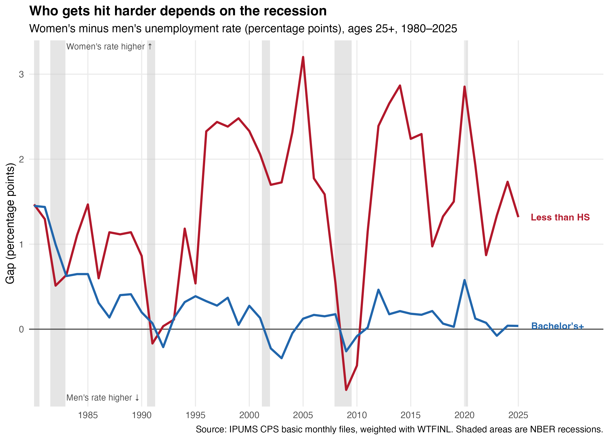
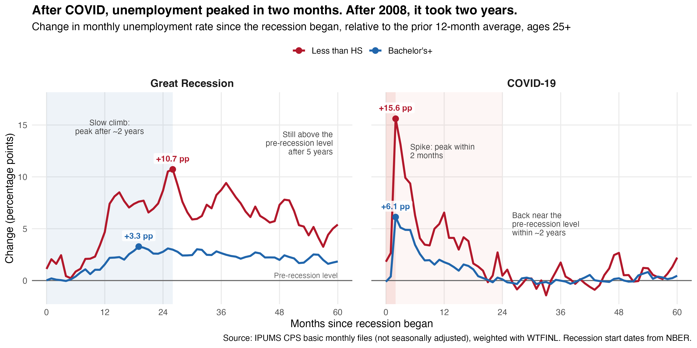

## Introduction

Many people go to college because they believe it will change their lives. In China, many students even go on to a master's degree, because a bachelor's degree no longer feels competitive when so many college students struggle to find jobs. But how much does education actually protect workers from unemployment?

In this post, I use data from IPUMS CPS to look at how unemployment rates differ across education groups over the past four decades. I also look at what happens during recessions, especially the Great Recession of 2007–2009 and the COVID-19 recession in 2020. I find that workers with more education have lower and more stable unemployment rates. However, how much education protects workers, and which groups are most affected, depend on the type of recession.

## Data

I use monthly data from the Current Population Survey (CPS), downloaded from IPUMS CPS. The CPS surveys about 60,000 U.S. households every month, and it is the main source of the official U.S. unemployment rate. My data covers 1980 to 2025, and the monthly data in @fig-recessions goes up to August 2026. I only include people aged 25 and older, because most people finish their education by that age. This is also the age group that the Bureau of Labor Statistics (BLS) uses when it reports unemployment by education. I group education into four categories: less than a high school diploma, high school diploma, some college or an associate degree, and a bachelor's degree or higher.

The unemployment rate is the share of people in the labor force who do not have a job but are actively looking for one. People who are not looking for work, like retirees and students, are not in the labor force. To make sure my results describe the whole U.S. population and not just the people in the survey, I use the CPS weight `WTFINL`. October 2025 is missing because the data was not collected during the federal government shutdown. To check my work, I compared my 2019 results with official BLS numbers, and they were almost the same.

## Unemployment by Education Over Time

{#fig-trend width=100%}

@fig-trend shows the annual unemployment rate for each education group from 1980 to 2025. The gray areas are recessions, based on dates from the National Bureau of Economic Research (NBER). There were six recessions in this period: two in the early 1980s caused by high inflation and interest rates, one in 1990–91 after an oil price shock, one in 2001 after the dot-com bubble, the Great Recession of 2007–2009 caused by the financial crisis, and the COVID-19 recession in 2020.

As expected, the order of the four lines never changes. Workers without a high school diploma always have the highest unemployment rate, and workers with a bachelor's degree or higher are always at the bottom.

The gap between the groups becomes much larger during recessions. For example, from 2007 to 2010, the unemployment rate for workers without a high school diploma rose from 7.2% to 15.0%, while for workers with a bachelor's degree or higher it only rose from 2.0% to 4.7%. In other words, less-educated workers are not only more likely to be unemployed, they are also more likely to lose their jobs when the economy gets worse.

However, the gap has become smaller in recent years. In 1980, workers without a high school diploma were about 3.7 times as likely to be unemployed as workers with a bachelor's degree. By 2025, they were only about 2.3 times as likely. Will this gap keep shrinking as AI changes the job market?

## Men and Women in Recessions

{#fig-gender width=100%}

@fig-gender looks at a different question: in each recession, were men or women hit harder? It shows the unemployment rate of women minus the unemployment rate of men. When the line is above zero, women have a higher unemployment rate. When it is below zero, men do.

Among workers without a high school diploma, women usually have a higher unemployment rate than men. In 2007, the gap was about 1.5 percentage points. But during the Great Recession, this changed. By 2009, men's unemployment rate had risen faster than women's, and it became higher than women's for the first time since 1991. One reason is that the financial crisis hit industries like construction and manufacturing the hardest, and most workers in these industries are men.

COVID-19 was the opposite. In 2020, the gap grew to 2.9 percentage points, almost twice as large as before. This is because the lockdowns closed many service jobs, such as restaurants, retail stores and hotels, where many workers are women. Also, when schools closed, women often took on more of the responsibility of caring for their children.

For workers with a bachelor's degree or higher, the gap was always small. One possible reason is that jobs that require a college degree are less concentrated in the industries hit hardest by these recessions, and during COVID-19, many of these jobs could be done from home.

## Two Very Different Recessions

{#fig-recessions width=100%}

@fig-recessions compares the two biggest recessions in my data: the Great Recession and COVID-19. The x-axis shows the number of months since each recession began, and the y-axis shows how much the unemployment rate changed compared with the year before the recession. Zero means the unemployment rate is the same as before the recession.

The two recessions look very different. In the Great Recession, unemployment rose slowly. For workers without a high school diploma, it took about two years to reach the peak, and even after five years, it was still higher than before the recession.

COVID-19 was the opposite. Unemployment jumped to its peak in only two months, but it also recovered quickly, returning close to the pre-recession level within about two years.

The difference comes from the causes of the two recessions. The Great Recession was caused by a financial crisis. Banks failed, many families lost their homes, and people and businesses lost confidence in the economy. This damage took years to fix. COVID-19 was caused by lockdowns that forced businesses to close. Many jobs were only paused, not lost forever. People still wanted to spend money, and the government also sent stimulus payments. So when the economy reopened, demand came back quickly, and many workers returned to their jobs.

In both recessions, education protected workers. During the Great Recession, unemployment rose by 10.7 percentage points for workers without a high school diploma, but only 3.3 for workers with a bachelor's degree or higher. During COVID-19, the numbers were 15.6 and 6.1.

However, COVID-19 hit even highly educated workers harder than the Great Recession did. Their unemployment rose by 6.1 percentage points, almost twice as much as during the Great Recession. This shows that no group was fully protected from such a sudden and widespread shock. Still, workers with a bachelor's degree were hit much less than workers without a high school diploma, so education continued to protect workers even in this very different kind of recession.

## Conclusion

Over the past four decades, more education has always meant a lower chance of being unemployed. Education also matters most when times are hard: in every recession, workers without a high school diploma lost their jobs at a much higher rate. But recessions are not all the same. The Great Recession hit men and industries like construction the hardest and took years to recover from, while COVID-19 hit women and service jobs the hardest but recovered quickly.

This is a descriptive analysis, so it does not show that education directly causes lower unemployment. People with more education may also differ in other ways, such as their skills, family background or the industries they work in. Still, for anyone deciding whether more education is worth it, the data suggests that a degree does not remove the risk of unemployment, but it makes the risk much smaller.

```{=html}
<div class="strawpoll-embed" id="strawpoll_PbZqbMbmAyN" style="height: 644px; max-width: 640px; width: 100%; margin: 0 auto; display: flex; flex-direction: column;"><iframe title="StrawPoll Embed" id="strawpoll_iframe_PbZqbMbmAyN" src="https://strawpoll.com/embed/PbZqbMbmAyN" style="position: static; visibility: visible; display: block; width: 100%; flex-grow: 1;" frameborder="0" allowfullscreen allowtransparency>Loading...</iframe><script async src="https://cdn.strawpoll.com/dist/widgets.js" charset="utf-8"></script></div>
```

## Code and Data

All code is on GitHub: [CPS-Unemployment-Education](https://github.com/xushiori-svg/Data-Visualization-with-the-U.S.-Labor-Market-IPUMS-CPS-.git). 