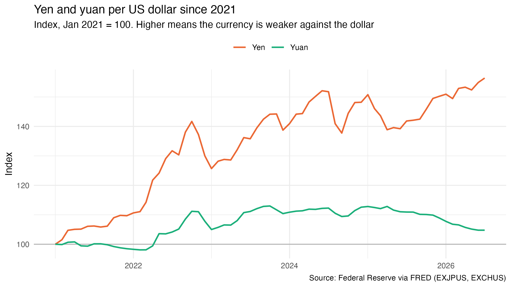
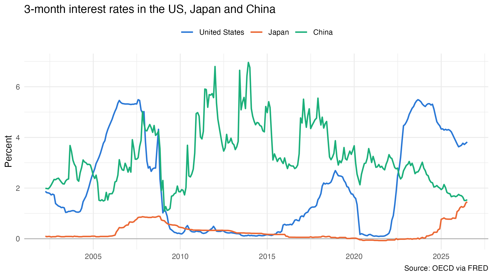
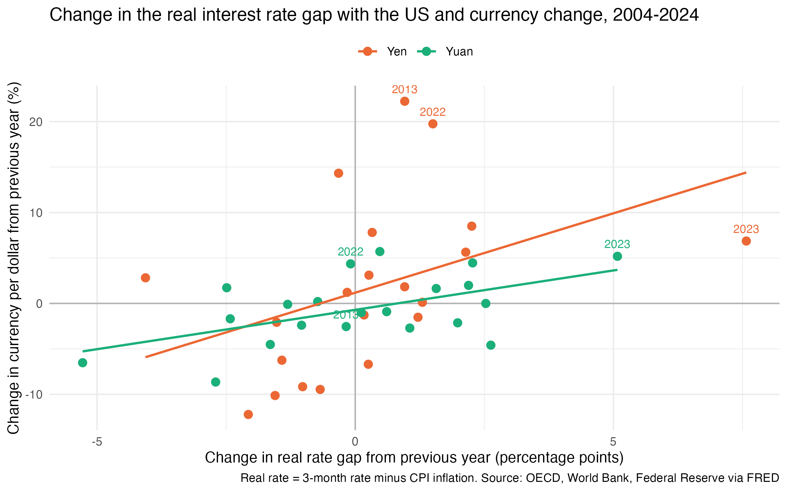

In January 2021, one US dollar bought about 104 Japanese yen. By July 2026, it bought about 162.

For Japanese families, that means imported food and fuel cost more. For tourists, Kyoto suddenly feels cheap.

China's yuan tells a different story. Over the same five years, it lost less than 5% against the dollar.

Both countries faced the same push from outside. Starting in 2022, the Federal Reserve raised interest rates faster than it had in four decades. So why did the two currencies react so differently?

A big part of the answer is interest rates at home. Japan kept its rates near zero while US rates jumped above 5%, which gave investors a strong reason to move money out of yen and into dollars. China's rates started higher, and its government keeps a close hand on how far the yuan can move.

To understand why the rate gap matters, we need to know how investors use it. When the interest rate in one country is much higher than in another country, investors can borrow money in the low-rate currency and invest it in the high-rate currency. This is called a carry trade. For many years, the yen was the cheapest currency to borrow, because Japan kept its interest rates close to zero.

The figure below shows the 3-month interest rates in the US, Japan and China since 2002. Before 2022, the rates in the US and Japan were quite close. After 2022, the US rate went up very quickly and reached more than 5% in 2023, while the Japanese rate stayed near zero.

China is different. Its interest rate went down from about 3% to below 2% as economic growth slowed, so after 2022 the US rate was also higher than the Chinese rate. However, the yuan was still much more stable than the yen. To see why, I look at how each currency reacted to changes in the rate gap over a longer period.

One problem is that interest rates alone can be misleading, because inflation also matters. For example, a 5% interest rate is not very attractive if prices go up by 4% every year. Therefore, I use the real interest rate, which is the interest rate minus the inflation rate. Then I calculate how the real rate gap between the US and each country changed from one year to the next, and compare it with how much each currency changed in the same year.

In the figure below, each dot is one year from 2004 to 2024. A dot on the right side means the US real rate became higher compared with Japan or China. A dot near the top means the currency became weaker against the dollar.

From the figure, we can see that the dots for both currencies go up from left to right. This means that when the real interest rate gap with the US becomes larger, both the yen and the yuan tend to become weaker. However, the line for the yen is much steeper. On average, when the gap increases by one percentage point, the yen becomes weaker by about 1.75%. For the yuan, the number is only about 0.87%, which is around half of the yen.

In addition, the yen changes much more from year to year. In 2022, the yen became almost 20% weaker against the dollar. For the yuan, the largest change in one year is about 9%, in 2008, and in that year the yuan actually became stronger. One possible reason is that the Chinese government manages the exchange rate, so the yuan cannot move as freely as the yen.

However, the interest rate gap cannot explain everything. The year 2013 is a good example. In that year, the real rate gap between the US and Japan only increased by about one percentage point, but the yen became about 22% weaker. Based on the average relationship in the figure, we would expect a change of only around 3%. The main reason is a policy change in Japan. In 2013, the Bank of Japan started a very large monetary easing program as part of "Abenomics," and many investors expected the yen to fall.

The most recent years also do not fully fit the pattern. From mid-2024 to mid-2026, the Federal Reserve cut interest rates and the Bank of Japan raised them, so the short-term rate gap between the two countries became much smaller, from about 5.2 to about 2.4 percentage points. If the rate gap were the only reason, the yen should have become stronger. Instead, it stayed weak, and in July 2026 one dollar still bought about 162 yen. This suggests that other factors, such as Japan's trade deficit and investors' expectations about future policy, also play an important role.

## Takeaway

The yen fell much more than the yuan because Japan kept its interest rates near zero while US rates went up quickly. When the rate gap with the US becomes wider, the yen reacts about twice as strongly as the yuan. However, the rate gap is not the only factor, and policy expectations can also move the yen a lot.

---

*Data: 3-month interbank interest rates (OECD), yen and yuan per US dollar (Federal Reserve) and annual CPI inflation (World Bank), all downloaded from FRED. I use 3-month rates because FRED does not have a 10-year government bond yield for China. Real rate = 3-month rate minus CPI inflation in the same year. The annual data covers 2003–2024 because 2025 US inflation is not yet available, and the slopes come from a simple linear regression of the yearly currency change on the yearly change in the real rate gap. Code and data are available on [GitHub](https://github.com/xushiori-svg/rate-gap-fx).*
